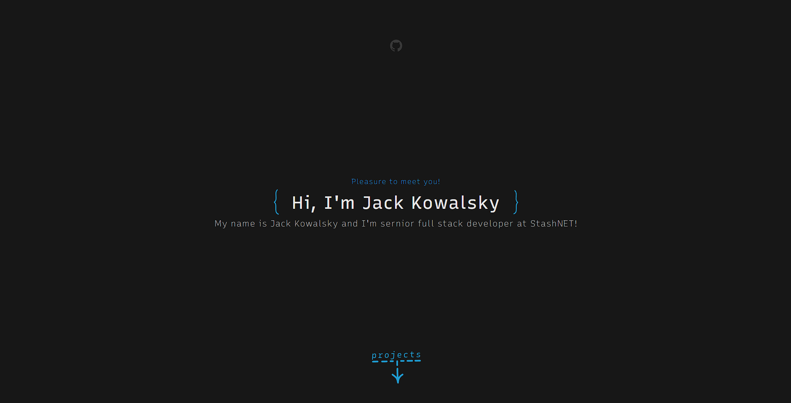

# Table of contents
* [General info](#general-info)
* [Setup](#setup)
* [ToDo](#todo)
* [What's next?](#whats-next?)

## General info
PortfolioCreator is simple a webapp with a Flask backend that lets the user build his Portfolio Webpage simply by filling one form.

## Setup


To run backend:
1. Go to src/python 
2. Install requirements and run the server: 
```
	pip3 install -r requirements.txt
	python3 main.py
```
3. Run the /html/main.html


## TODO 
* Improve the design and responsiveness of both main.html and created webpage [❌]
* Implement the path folder mapping while creating .zip [❌]

## What's next? 
I plan to successively add portfolio templates with better features (enabling dark mode, animations and overall better design) 
